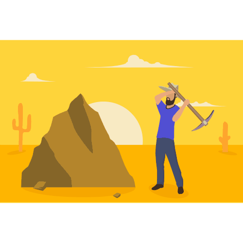

<h1 align="center">Hi 👋, I'm Anubhaw Kumar Sharma</h1>

<h3 align="center">A Mining Engineer | Android App developer | vector Artist | IoT enthusiast</h3>

  

<h3> 👨 About Me </h3>

- Undergraduate student,pursuing B.Tech in Mining Engineering (2k18 - 22) at [BIT Sindri](https://bitsindri.ac.in/)

- Vice President at Hackathon and coding club [HnCC](https://hnccbits.com/)

- Interested in Android App development

- Loves to draw vector arts

- My Mentors are [Sourav Paul](https://github.com/souravpaul8) and [Snehal](https://github.com/snehal2398) sir.

- My colleague is [Shivam Anand](https://github.com/anandshivam44),together we are [#Team_Voyager](https://www.facebook.com/teamvoyagerfb/)
   

<h3 align="left">Languages and Tools:</h3>

                

&nbsp;

<h3 align="left">Connect with me:</h3>

